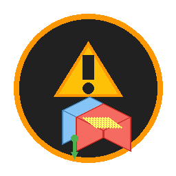

# Z-Fighting Fixer for Blockbench

A powerful Blockbench plugin that automatically detects and fixes z-fighting issues in your models.

## Features

✨ **Automatic Detection** - Scans all cubes and identifies overlapping faces  
🔧 **Smart Fixing** - Applies inflate to conflicting cubes automatically  
⚙️ **Customizable Settings** - Adjust detection tolerance and inflate amount  
📊 **Detailed Reports** - Shows exactly which cubes are conflicting  
🎯 **Multiple Fix Methods** - Choose how to apply the fix (second cube, both, or all)  
🔄 **Auto Recheck** - Automatically verifies fixes after applying them

## Installation

### Method 1: From File (Recommended)
1. Download `z_fighting_fixer.js` from the [latest release](https://github.com/yourusername/z-fighting-fixer/releases)
2. Open Blockbench
3. Go to **File → Plugins**
4. Click **"Load Plugin from File"**
5. Select the downloaded `z_fighting_fixer.js` file

### Method 2: From URL
1. Open Blockbench
2. Go to **File → Plugins**
3. Click **"Load Plugin from URL"**
4. Paste the raw GitHub URL of `z_fighting_fixer.js`

## Usage

### Quick Start

1. Open your model in Blockbench
2. Go to **Tools** menu
3. You'll see three new options:
   - **Detect Z-Fighting** - Scan for issues
   - **Fix Z-Fighting** - Automatically fix issues
   - **Z-Fighting Settings** - Configure the plugin

### Detecting Issues

Click **Tools → Detect Z-Fighting** to scan your model. The plugin will:
- Check all cubes for overlapping faces
- Show a detailed report of any conflicts found
- Display which cubes are conflicting and on which axes

### Fixing Issues

Click **Tools → Fix Z-Fighting** to automatically fix detected issues:

1. **Choose Fix Method:**
   - **Inflate second cube only** (recommended)
   - **Inflate both cubes**
   - **Inflate all conflicting cubes**

2. **Adjust Inflate Amount** (optional)
   - Default: 0.05
   - Increase for more separation
   - Decrease for subtle fixes

3. Click **Confirm** to apply the fix

### Customizing Settings

Click **Tools → Z-Fighting Settings** to configure:

- **Inflate Amount** (0.001 - 1.0)
  - How much to inflate cubes
  - Higher = more separation between faces
  - Default: 0.05

- **Detection Tolerance** (0.0001 - 0.1)
  - Distance threshold for detecting overlaps
  - Lower = stricter detection
  - Default: 0.001

- **Auto Recheck After Fix**
  - Automatically scan again after fixing
  - Helpful for verifying fixes worked
  - Default: On

## How It Works

Z-fighting occurs when two faces occupy the same space, causing flickering in-game. This plugin:

1. **Scans** all cubes in your model
2. **Detects** faces that are overlapping or too close (within tolerance)
3. **Applies** the "inflate" property to separate conflicting faces
4. **Verifies** the fix was successful (if auto-recheck is enabled)

The inflate property slightly expands the cube, creating separation without changing the visual appearance significantly.

## Tips

💡 **Start with Detection** - Always run "Detect Z-Fighting" first to see what issues exist  
💡 **Use Default Settings** - The default inflate amount (0.05) works well for most cases  
💡 **Multiple Passes** - If issues persist, run "Fix Z-Fighting" again to add more inflate  
💡 **Check Console** - Open Developer Tools to see detailed logs of what's being fixed  
💡 **Manual Tweaking** - After auto-fix, you can manually adjust cube positions if needed

## Troubleshooting

**Plugin won't load?**
- Make sure the file is named exactly `z_fighting_fixer.js`
- Check that you're using Blockbench 4.0 or higher

**Still seeing z-fighting after fix?**
- Increase the inflate amount in settings
- Try running "Fix Z-Fighting" multiple times
- Check if the same cubes keep conflicting

**False positives?**
- Increase detection tolerance in settings
- Some very close faces may not actually cause z-fighting in-game

## Compatibility

- ✅ Blockbench 4.0+
- ✅ Windows, macOS, Linux
- ✅ Java Edition models
- ✅ Bedrock Edition models
- ✅ Generic models

## Contributing

Found a bug or have a feature request? Please open an issue on GitHub!

## License

MIT License - See LICENSE file for details

## Credits

Created by Robotic1545
Icon design: DragonStudios

---

**Enjoy z-fighting free plugin!** 🎮✨
